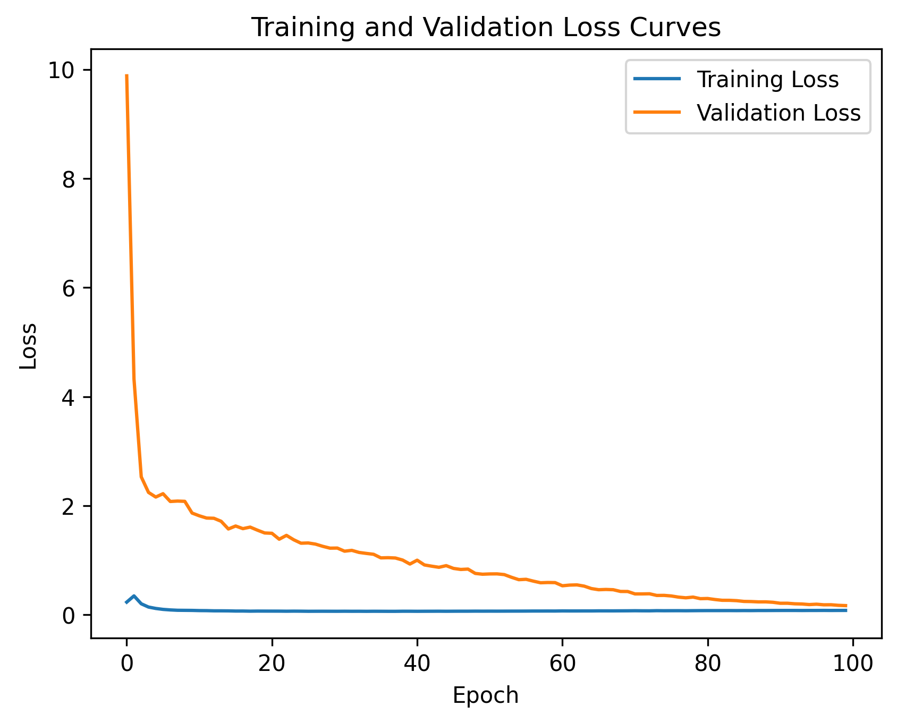

# Loan Default Prediction


A deep learning binary classifier that predicts loan default risk with **97.25% recall**, minimising costly false negatives. Uses SMOTEENN for class imbalance handling, L2 regularisation, dropout, and exponential learning rate decay.

---

## Why Recall Matters

In lending, **missing a defaulter (false negative) is far more expensive than a false alarm (false positive)**. This model prioritises recall as the primary optimisation metric.

| Metric | Value |
|--------|-------|
| Accuracy | 93.10% |
| Precision | 69.66% |
| **Recall** | **97.25%** |
| False Negative Rate | 2.75% |

---

## Architecture

```
┌─────────────┐     ┌──────────────┐     ┌──────────────────┐     ┌──────────┐
│  Loan Data  │────▶│  SMOTEENN   │────▶│  Neural Network  │────▶│  Predict │
│  (Excel)    │     │  Resampling │     │  4 Dense Layers  │     │  Default │
└─────────────┘     └──────────────┘     │  30-30-15-15     │     └──────────┘
                                          │  + Dropout 50%   │
                                          │  + L2 Regularise │
                                          │  + Exp LR Decay  │
                                          └──────────────────┘
```

### Model Specs

| Layer | Neurons | Activation | Regularisation |
|-------|---------|------------|----------------|
| Dense 1 | 30 | ReLU | L2 + Dropout 50% |
| Dense 2 | 30 | ReLU | L2 + Dropout 50% |
| Dense 3 | 15 | ReLU | L2 + Dropout 50% |
| Dense 4 | 15 | ReLU | L2 + Dropout 50% |
| Output | 1 | Sigmoid | — |

### Training Curve



---

## Key Features

- **Class Imbalance Handling** — SMOTEENN (SMOTE + Edited Nearest Neighbours) oversamples minority class and cleans noisy samples
- **Regularisation Stack** — L2 weight decay + 50% dropout + exponential learning rate decay prevent overfitting
- **Recall-Focused Optimisation** — Model selected based on recall, not accuracy
- **Reproducible Pipeline** — Single Python script with fixed random seeds

---

## Project Structure

```
├── loan default project.py   # Full training pipeline
├── loan_data.xlsx            # Input dataset
├── loss_curves.png           # Training/validation loss plot
└── README.md
```

---

## Installation & Usage

```bash
git clone https://github.com/Piyali-Narnaware/Loan-Default-Prediction.git
cd Loan-Default-Prediction
pip install tensorflow scikit-learn imbalanced-learn pandas numpy matplotlib openpyxl
```

Run the full pipeline:

```bash
python "loan default project.py"
```

---

## Dependencies

- Python 3.11+
- TensorFlow / Keras
- scikit-learn, imbalanced-learn
- pandas, numpy, matplotlib, openpyxl
